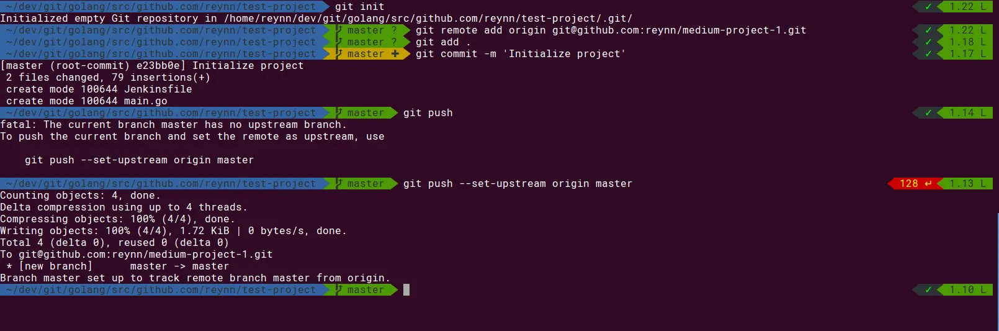
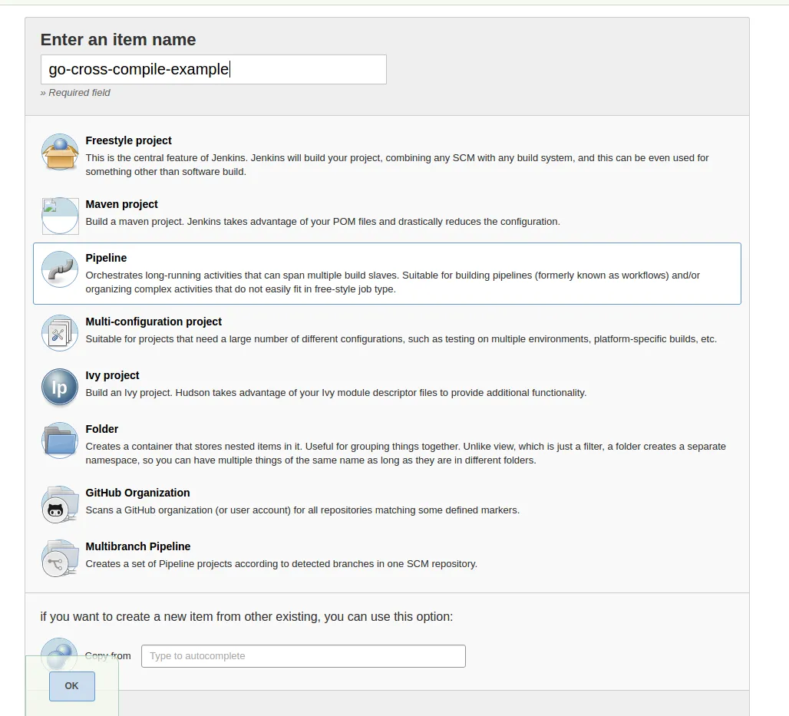
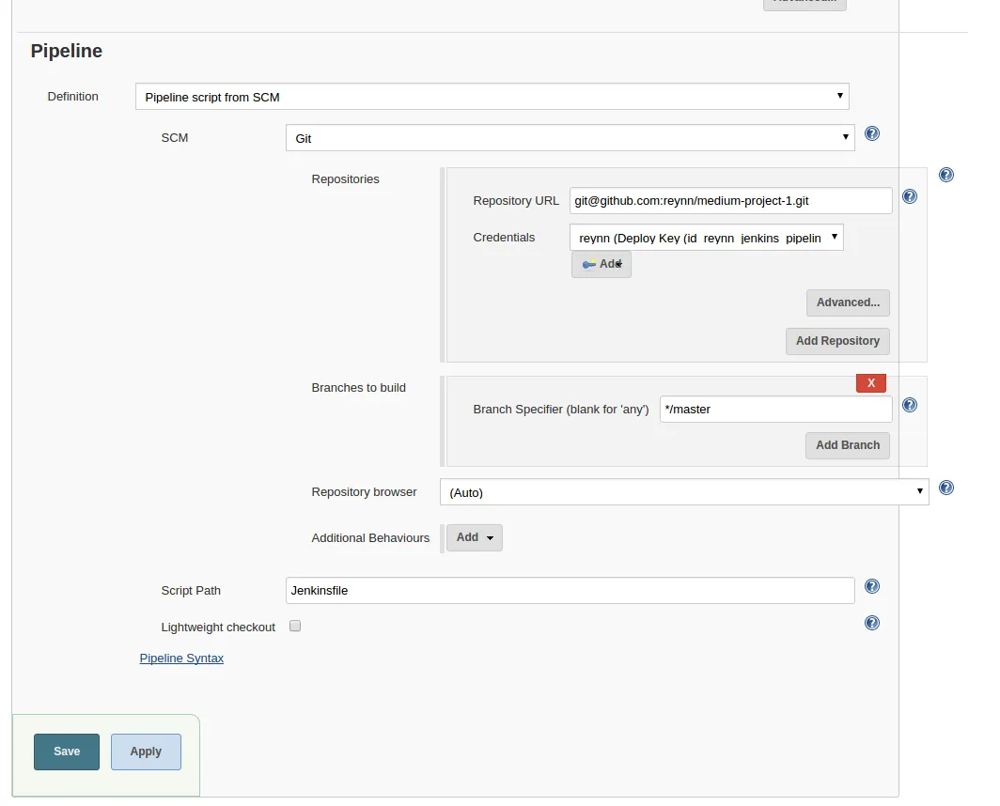

+++
title = "Automate cross platform Golang builds with Jenkins"
date = "2017-04-23T06:03:58-04:00"
author = "Nic Patterson"
authorTwitter = "AReynn3" #do not include @
cover = ""
tags = ["jenkins", "ci", "golang"]
keywords = ["golang", "ci", "jenkins"]
description = "Quick start guide to building Golang binaries for multiple platforms using Jenkins 2.x"
showFullContent = false
readingTime = true
hideComments = false
color = "" #color from the theme settings
+++

Note: This was originally published on my Medium page [here](https://medium.com/@reynn/automate-cross-platform-golang-builds-with-jenkins-ef7b07f1366e)

Go makes it really easy to cross-compile your apps. This can be advantageous for developers who want to reach the largest audience with their apps, or developers that want flexibility in where their apps are deployed to in production. Here we’ll walk through a simple example of how to utilize Jenkins 2.x pipeline to automate this process.

## Requirements

- Golang 1.5+ (we’ll be using 1.8 here)
- Jenkins 2.x with the Pipeline plugin
- GitHub or Bitbucket account
- Text editor of choice (Sublime Text, NeoVim, VS Code)

### Expectations

- Basic knowledge of Git and GitHub
- Basic experience with Go and how to structure a project.

## Step 1: Go

Here is the small “Hello, World” type app written in Go that will work on any platform.

```go
package main

// Import the fmt for formatting strings
// Import os so we can read environment variables from the system
import (
	"fmt"
	"os"
)

// create a function named getUserName that returns a single string
func getUserName() string {
	// On Linux and Mac the username is available as simply USER
	username := os.Getenv("USER")
	// check if we got an empty string and attempt to get USERNAME instead which would be available on Windows
	if username == "" {
		username = os.Getenv("USERNAME")
	}
	// Return whatever we received
	return username
}

// entrypoint function for our app
func main() {
	fmt.Printf("Hello, %s\n", getUserName())
}
```

## Step 2: Jenkinsfile

Jenkinsfiles were introduced in Jenkins 2 and allows you to define your build process and store it in source control, for more information refer to the documentation here. In this tutorial we will use our Jenkinsfile, using scripted pipeline syntax, to build 3 binaries (Windows, Linux and Mac) and archive them in Jenkins.

```groovy
#!/usr/bin/env groovy

// this will start an executor on a Jenkins agent with the docker label
node('docker') {
  // Setup variables
  // application name will be used in a few places so create a variable and use string interpolation to use it where needed
  String applicationName = "basic-app"
  // a basic build number so that when we build and push to Artifactory we will not overwrite our previous builds
  String buildNumber = "0.1.${env.BUILD_NUMBER}"
  // Path we will mount the project to for the Docker container
  String goPath = "/go/src/github.com/reynn/${applicationName}"

  // Checkout the code from Github, stages allow Jenkins to visualize the different sections of your build steps in the UI
  stage('Checkout from GitHub') {
    // No special needs here, if your projects relys on submodules the checkout step would need to be different
    checkout scm
  }

  // Start a docker container using the golang:1.8.0-alpine image, mount the current directory to the goPath we specified earlier
  stage("Create binaries") {
    docker.image("golang:1.8.0-alpine").inside("-v ${pwd()}:${goPath}") {
      // build the Mac x64 binary
      sh "cd ${goPath} && GOOS=darwin GOARCH=amd64 go build -o binaries/amd64/${buildNumber}/darwin/${applicationName}-${buildNumber}.darwin.amd64"
      // build the Windows x64 binary
      sh "cd ${goPath} && GOOS=windows GOARCH=amd64 go build -o binaries/amd64/${buildNumber}/windows/${applicationName}-${buildNumber}.windows.amd64.exe"
      // build the Linux x64 binary
      sh "cd ${goPath} && GOOS=linux GOARCH=amd64 go build -o binaries/amd64/${buildNumber}/linux/${applicationName}-${buildNumber}.linux.amd64"
    }
  }

  stage("Archive artifacts") {
    // Archive the binary files in Jenkins so we can retrieve them later should we need to audit them
    archiveArtifacts artifacts: 'binaries/**', fingerprint: true
  }
}
```

## Step 3: Commit to GitHub

We have the code, now we need it in source control, create a repository in GitHub and then use `git add . && git commit -m 'initial' && git push`.



## Step 4: Create Jenkins job

Now we get to add our code to Jenkins and watch it build our binaries for the first time. Go to your Jenkins server and log in if needed, we will create a new item which is listed on the left side. We can go with either a Pipeline or Multibranch job, multibranch is good if you want to make a complete pipeline that does certain things depending on what branch your code is committed to, regular pipeline is if you are doing some one off things that are not part of a larger pipeline but that you still want to be able to track in a source control system.



The pipeline job structure just needs you to either give it a Jenkinsfile or point it at the SCM of your choice. Putting your Jenkinsfile content in directly can be really useful for testing, however we are going to point it our Github project.



Here we are going to:

- Set the definition to “Pipeline script from SCM”
- Set the SCM to Git
- The repository URL will be either the SSH or HTTPS clone URL you can get from Jenkins, I tend to prefer SSH myself but whichever you are more comfortable with is fine here.
- Credentials will need to be either a credential with your username/password for HTTPS or your SSH private key for SSH checkout.
- Branches to build can be left on the default of */master
- Script Path can be used to give Jenkins an alternate path to your Jenkinsfile if you put it in a sub path or want to have it named something different.
- Lightweight checkout can be on or off here, if it is on it will try to only pull the Jenkinsfile instead of the entire repository. This can be useful if you have a large project with a lot of assets that does nothing at all on the Jenkins master.

Once all of our information is set here press save. With the regular pipeline projects Jenkins will not start building the project automatically, multibranch pipelines do start building all branches with a Jenkinsfile as soon as configuration is complete. Once you are ready go ahead and press “Build Now” and wait for the build to complete. First build will take a bit longer since it will need to pull down the Docker image we specified but should complete in around 5 minutes or less.

### Publish binaries to Artifactory

Thanks to Jenkins extensive plugins there are ways to do just about anything you may want to do in a CI/CD pipeline. A typical scenario in a pipeline like this is to publish your binaries to some kind of binary repo such as Jfrog Artifactory or Sonatype Nexus. With both of these we are going to be publishing as a generic artifact. We’ll assume you already have an Artifactory instance available to you for this, the OSS version is sufficient and is available as a Docker image if you want to quickly get up and running with it. Add the following code to your Jenkinsfile at the bottom before the end of the node('docker') closing brace.

```groovy
stage("Publish to Artifactory") {
  // create a Artifactory server reference with some credentials we stored in Jenkins already
  def server = Artifactory.newServer url: 'http://artifactory.example.com/artifactory', credentialsId: 'artifactory-credentials'
  // Upload spec is a definition for the Artifactory plugin to tell it how and what to upload, and where in Artifactory it should go
  def uploadSpec = """{
    "files": [
      {
        "pattern": "binaries/*",
        "target": "generic-local/golang/${applicationName}/",
        "flat": false
      }
    ]
  }"""
  // perform the upload
  server.upload(uploadSpec)
}
```

In the uploadSpec the target will need to start with a valid repository already set up in Artifactory, the rest of the path will be created on the fly if needed. With the flat parameter being set to false here so that it will keep the folder structure when publishing, this can be removed or set to true if you want to have all files in the same directory in Artifactory. Once you have this setup the way you want you can commit to Github with git commit -am 'add Artifactory publish' && git push then go back to Jenkins and press Build Now again. This time the build will be even faster since we already have the Docker image locally and after a few minutes you can go to Artifactory and see the newly created binaries.

## Next Steps

So far we have created a basic pipeline that will build our app inside of a Docker container and we manage to get a binary for three different OSes. Inside of Jenkins we will be able to see the artifacts and download them directly from the UI. A few things to automate this further would be to setup a webhook in Github that points to your Jenkins instance so that when code is pushed up Jenkins will automatically build and produce your binaries.

All code for this is available at https://github.com/reynn/jenkins-go-cross-compile
